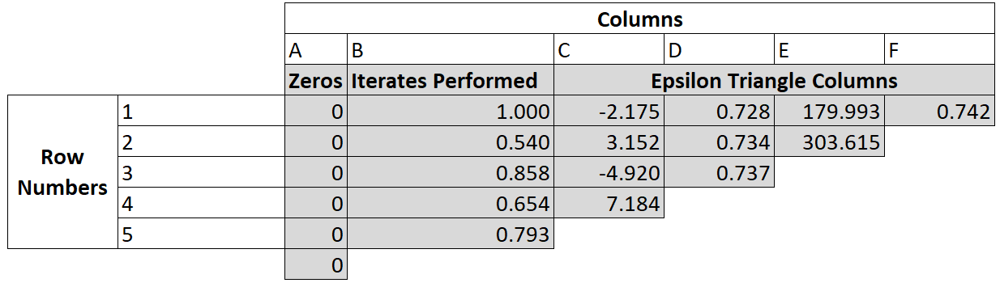
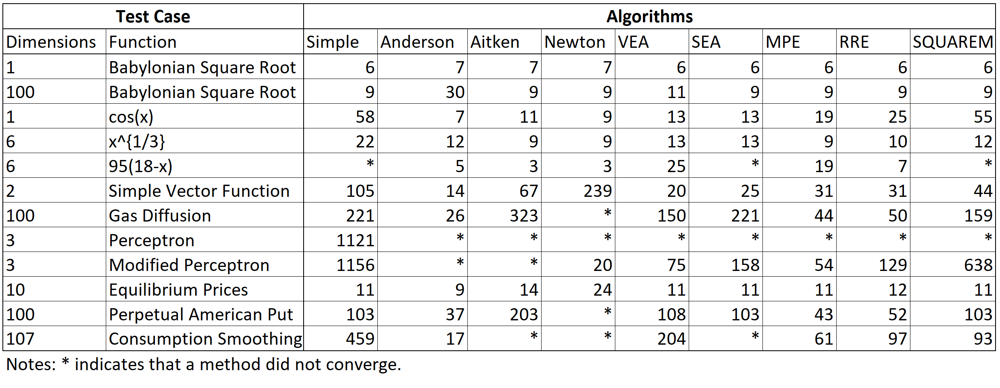

R has had a number of packages providing optimisation algorithms for many years. These include traditional optimisers through the [**optim**](https://stat.ethz.ch/R-manual/R-devel/library/stats/html/optim.html) method, genetic algorithms through the [**rgenoud**](https://cran.r-project.org/package=rgenoud) package and response surface global optimisers through packages like [**DiceKriging**](https://cran.r-project.org/package=DiceKriging). It also has several rootfinders like the [**uniroot**](https://stat.ethz.ch/R-manual/R-devel/library/stats/html/uniroot.html) method and the methods of the [**BB**](https://CRAN.R-project.org/package=BB) package.

Fixed point accelerators are conceptually similar to both optimisation and root finding algorithms but thus far implementations of fixed point finders have been rare in R. Prior to FixedPoint's release the squarem method of the **turboEM** package **turboEM** was the only effective fixed point acceleration algorithm available in R.
 In some part this is likely because there is often an obvious method to find a fixed point by merely feeding a guessed fixed point into a function, taking the result and feeding it back into the function. By doing this repeatedly a fixed point is often found. This method (that we will call the "Simple" method) is often convergent but it is also often slow which can be prohibitive when the function itself is expensive.

**FixedPoint** provides eight algorithms for finding fixed points. The first is the simple method as described earlier. There are also the Newton, Aitken and Scalar Epsilon Algorithm (SEA) methods that are designed for accelerating the convergence of scalar sequences. Four algorithms for accelerating vector sequences are also implemented including the Vector Epsilon Algorithm (VEA), two minimal polynomial algorithms (MPE and RRE)  and Anderson acceleration.

In this paper section 1 starts by with a brief explanation of fixed points before section 2 describes the acceleration algorithms provided by **FixedPoint**. Here the goal is  to illustrate the logic underling each algorithm so users can better choose which suits their problem. Readers interested in the underlying mathematics are referred to the original papers. Section 3 then illustrates a few features of the package that enable users to better track the progress of an algorithm while it is running and switch algorithms if desired before a fixed point is found.

Section 4 then presents several applications of these fixed point algorithms in economics, asset pricing and machine learning. Finally section 5 presents a convergence comparison showing how many iterations each algorithm takes in bringing each problem to its fixed point for each of the applications presented in section 4.

# 1 Fixed point acceleration

A fixed point problem is one where we look for a vector, $\hat{X} \in \Re^N$, so that for a given function $f: \Re^N \rightarrow \Re^N$ we have:

$$f(\hat{X}) = \hat{X}$$

If $f: \Re^1 \rightarrow \Re^1$ and thus any solution $\hat{X}$ will be a scalar then one way to solve this problem would be to use a rootfinder on the function $g(x) = f(x) - x$ or to use an optimiser to minimise $h(x) = (f(x) - x)^2$. These techniques will not generally work however if $f : N^a \rightarrow N^a$ where $a$ is large. Consider for instance using a multidimensional Newtonian optimiser to minimise $h(x) = (f(x) - x)^2$. The estimation of gradients for each individual dimension may take an infeasibly long time. In addition this method may not make use all available information. Consider for instance that we know that the solution for $x$ will be an increasing vector (so $x_i > x_j$ for any entries of $x$  with $i > j$) but has many entries. This information can be preserved and used in the vector acceleration algorithms that we present but would be more difficult to exploit in a standard optimisation algorithm.

Much of the intuition behind the use of optimisers and rootfinders carries over to the use of fixed point acceleration algorithms. Like a function may have multiple roots and optima, a function may have multiple fixed points. The extreme case of this is the identity mapping $f(x) = x$ for which every $x$ is a fixed point. Some functions have no roots or optima and likewise some functions do not possess fixed points. This is the case for the function $f(x) = \frac{-1}{x}$. From a practical standpoint, it is often useful to have access to multiple optimisers and rootfinders as different algorithms are better suited to different types of functions. This is also the case for finding fixed points and the FixedPoint package is useful in this regard, offering eight fixed point algorithms.

The first algorithm implemented in this package is the "simple" method which merely takes the output of a function and feeds it back into the function. For instance starting with a guess of $x_0$, the next guess will be $x_1 = f(x_0)$. The guess after that will be $x_2 = f(x_1)$ and so on. Under some conditions $f$ will be a contraction mapping and so the simple method will be guaranteed to converge to a unique fixed point. Even when this is the case however the simple method may only converge slowly which can be inconvenient. The other seven methods this package implements are designed to be faster than the simple method but may not be convergent for every problem.

# 2 Acceleration algorithms

## 2.1 Newton acceleration

Here we will define $g(x) = f(x) - x$. The general approach is to solve $g(x)$ with a rootfinder. The $x$ that provides this root will be a fixed point. Thus after two iterates we can approximate the fixed point with:

$x_{i+1} = x_i - \frac{g(x_i)}{g^\prime(x_i)}$

**FixedPoint** approximates the derivative $g^\prime(x_i)$ so that we use an estimated fixed point of: 

$x_{i+1} = x_i - \frac{g(x_i)}{  \frac{ g(x_i) - g(x_{i-1})}{x_i-x_{i-1}}      }$

The implementation of the Newton method in this package uses this formula to predict the fixed point given two previous iterates.[^1] This method is designed for use with scalar functions.

[^1]: Only two rather than three are required because we can use $x_{i+1} = f(x_i)$ and $x_{i+2} = f(x_{i+1})$.


## 2.2 Aitken acceleration

Consider that a sequence of scalars $\{ x_i \}_{i=0}^\infty$ that converges linearly to its fixed point of $\hat{x}$. This implies that for a large $i$:

$\frac{\hat{x} - x_{i+1}}{\hat{x} - x_i} \approx \frac{\hat{x} - x_{i+2}}{\hat{x} - x_{i+1}}$

For a concrete example consider that every iteration halves the distance between the current vector and the fixed point. In this case the left hand side will be one half which will equal the right hand side which will also be one half.

This above expression can be simply rearranged to give a formula predicting the fixed point that is used as the subsequent iterate. This is:

$x_{i+1} = x_{i} - \frac{  (x_{i+1} - x_i)^2  }{  x_{i+2} - 2x_{i+1} + x_i}$

The implementation of the Aitken method in **FixedPoint** uses this formula to predict the fixed point given two previous iterates. This method is designed for use with scalar functions. If it is used with higher dimensional functions that take and return vectors then it will be used elementwise. 

## 2.3 Epsilon algorithms

The epsilon algorithms introduced by @Wynn1962 provides an alternate method to extrapolate to a fixed point. This paper will present a brief numerical example and refer readers to @Wynn1962 or @SmithFordSidi1987 for a mathematical explanation of why it works.
The basic epsilon algorithm starts with a column of iterates (column B in the below figure). If $i$ iterates have been performed then this column will have a length of $i+1$ (the initial starting guess and the results of the $i$ iterations). Then a series of columns are generated by means of the below equation:

$\epsilon_{c+1}^r = \epsilon_{c-1}^{r+1} + (\epsilon_{c}^{r+1} - \epsilon_{c}^{r})^{-1}$

Where $c$ is a column index and $r$ is a row index. The algorithm starts with the $\epsilon_0$ column being all zeros and $\epsilon_1$ being the column of the sequence iterates. The value in the furthest right column ends up being the extrapolated value.

This can be seen in the below table which uses an epsilon method to find the fixed point of $\cos(x)$ with an initial guess of a fixed point of $1$.


                                
In this figure B1 is the initial guess of the fixed point. Then we have the iterates $B2 = \cos(B1)$, $B3 = \cos(B2)$ and so on. Moving to the next column we have $C1 = A2 + 1/(B2-B1)$ and $C2 = A3 + 1/(B3-B2)$ and so on before finally we get $F1 = D2 + 1/(E2-E1)$. As this is the last entry in the triangle it is also the extrapolated value.

Note that the values in columns C and E are poor extrapolations. Only the even columns D,F provide reasonable extrapolation values. For this reason an even number of iterates (an odd number of values including the starting guess) should be used for extrapolation. **FixedPoint**'s functions will enforce this by throwing away the first iterate provided if necessary to get an even number of iterates.

In the vector case this algorithm can be visualised by considering each entry in the above table to contain a vector going into the page. In this case the complication emerges from the inverse - there is no clear interpretation of $(\epsilon_{c}^{r+1} - \epsilon_{c}^{r})^{-1}$ where $(\epsilon_{c}^{r+1} - \epsilon_{c}^{r})$ represents a vector. The Scalar Epsilon Algorithm (SEA) uses elementwise inverses to solve this problem which ignores the vectorised nature of the function. The Vector Epsilon Algorithm (VEA) uses the Samuelson inverse of each vector $(\epsilon_{c}^{r+1} - \epsilon_{c}^{r})$.

## 2.4 Minimal polynomial algorithms

**FixedPoint** implements two minimal polynomial algorithms, Minimal Polynomial Extrapolation (MPE) and Reduced Rank Extrapolation (RRE). This section will simply present the main equations but an interested reader is directed to @CabayJackson1976 or @SmithFordSidi1987 for a detailed explanation.

To first define notation, each vector (the initial guess and subsequent iterates) is defined by $x_0, x_1, ...$ . The first differences are denoted $u_j = x_{j+1} - x_{j}$ and the second differences are denoted $v_j = u_{j+1} - u_j$. If we have already completed $k-1$ iterations (and so we have $k$ terms) then we will use matrices of first and second differences with $U = [ u_0 , u_1 , ... , u_{k-1} ]$ and $V = [ v_0 , v_1, ... , v_{k-1} ]$.

For the MPE method the extrapolated vector, $s$, is found by:

$s = \frac{ \sum^k_{ j=0 }  c_j x_j }{ \sum^k_{j=0} c_j }$

Where the coefficient vector is found by $c = -U^{+} u_k$ where $U^{+}$  is the Moore-Penrose generalised inverse of the $U$ matrix. 
In the case of the RRE the extrapolated vector, $s$, is found by:

$s = x_0 - U V^+ u_0$

## 2.5 Anderson acceleration

@Anderson1965 acceleration is an acceleration algorithm that is well suited to functions of vectors. Similarly to the minimal polynomial algorithms it takes a weighted average of previous iterates. It is different however to these algorithms (and the VEA algorithm) in that previous iterates need not be sequential but any previous iterates can be used.

Consider that we have previously run an N-dimensional function M times. We can define a matrix $G_i = [g_{i-M} , g_{i-M+1}, ... , g_i]$ where $g(x_j) = f(x_j) - x_j$. Each column of this matrix can be interpreted as giving the amount of ``movement'' that occurred in a run of the function.

Now Anderson acceleration defines a weight to apply to each column of the matrix. This weight vector is M-dimensional and can be denoted $\{\mathbf{\alpha} = \alpha_0, \alpha_1,  ... , \alpha_M\}$. These weights are determined by means of the following optimisation:

$\min_\mathbf{\alpha} \vert\vert G_i \mathbf{\alpha} \vert\vert_2$
$\hspace{1cm} s.t. \sum^M_{j=0} \alpha_j = 1$

Thus we choose the weights that will be predicted to create the lowest ``movement'' in an iteration.

With these weights we can then create the expression for the next iterate as:

$x_{i+1} = \sum_{j=0}^M \alpha_j f(x_{i-M+j})$

The actual implementation differs from the proceeding description by recasting the optimisation problem as an unconstrained least squares problem (see @FangSaad2009 or @WalkerNi2011) but in practical terms is identical.

# 3.  Using the FixedPoint package

## 3.1 Basic examples of using FixedPoint

### The Babylonian method for finding square roots.

Now we will demonstrate how **FixedPoint** can be used for simple problems. For the simplest possible case consider we want to estimate a square root using the Babylonian method. To find the square root of a number $x$, given an initial guess $t_0$ the following sequence converges to the square root:

$t_{n+1} = \frac{1}{2} \left[ t_n + \frac{x}{t_n} \right]$

This is a fast converging and inexpensive sequence which probably makes an acceleration algorithm overkill but for sake of exposition we can implement this in **FixedPoint**. In the next code block we find the square root of 100 with the simple method:

```r
library(FixedPoint)
SequenceFunction = function(tn){0.5*(tn + 100/tn)}

FP_Simple   = FixedPoint(Function=SequenceFunction,Inputs = 6,  Method = "Simple")
```

We can also solve for a vector of fixed points at the same time. For instance every square root from 1 to 100.

```r
NumbersVector = 1:100
SequenceFunction = function(tn){0.5*(tn + NumbersVector/tn)}
FP_SEA   = FixedPoint(Function = SequenceFunction, Inputs = 1:100,  Method = "RRE")
```

### Vectorised functions

The utility of the acceleration algorithms contained in **FixedPoint** are more apparent when applied to vectorised functions with cross dependency. For a simple example consider the below function where each entry of the vector depends on both entries of the previous iterate.

```r
SimpleVectorFunction = function(x){c(0.5*sqrt(abs(x[1] + x[2])), 1.5*x[1] + 0.5*x[2])}
FP_Simple = FixedPoint(Function = SimpleVectorFunction, Inputs = c(0.3,900), Method = "Simple")
FP_Anderson = FixedPoint(Function = SimpleVectorFunction, Inputs = c(0.3,900), Method = "Anderson")
```
This function takes 105 iterates to find a fixed point with the simple method but only 14 with the Anderson acceleration method.


## 3.2 Easily changing algorithm

A key priority in writing **FixedPoint** is for ease in changing fixed point method. The algorithm can be stopped and then restarted without having to repeat earlier iterations. This can be seen in the simple example below:

```r
Run1 = FixedPoint(Function = function(x){x^0.2}, Inputs = c(0.3, 0.4,0.5),
                Method = "Aitken")
cat(paste("Running this all at once takes ", length(Run1$Convergence), " iterations and 
          convergences to ",  Run1$Convergence[length(Run1$Convergence)], "\n"))
```

```
## Running this all at once takes  9  iterations and 
##           convergences to  1.11022302462516e-15
```

```r
Run2_1 = FixedPoint(Function = function(x){x^0.2}, Inputs = c(0.3, 0.4,0.5),
                Method = "Aitken", MaxIter = 4)
# Check some condition about the convergence or change algorithm.
Run2_2 = FixedPoint(Function = function(x){x^0.2}, Inputs = Run2_1$Inputs, 
                    Outputs = Run2_1$Outputs, Method = "Aitken")
cat(paste("Running this with a break takes ", length(Run2_2$Convergence), " iterations and 
          convergences to ",  Run2_2$Convergence[length(Run2_2$Convergence)], "\n"))
```

```
## Running this with a break takes  9  iterations and 
##           convergences to  1.11022302462516e-15
```

This can be useful in problems where it is desired to switch extrapolation methods half way through. For instance in the consumption smoothing case presented later, the Vector Epsilon Algorithm converges quickly to a convergence level around $10^{-4}$ but then spends around 100 iterations hovering around this level without reducing further. In this case the algorithm could be changed to the simple method or Anderson method once the algorithm hit some target level of convergence.

Another example is parallelisation. The Anderson method in particular is well suited to use the results of previous iterates and these iterates do not need to be generated sequentially. If a suitable collection of guess vectors can be generated[^4] then all could be evaluated in parallel and recombined before again being used by the Anderson algorithm to generate a new guess. An example of this is presented later when the package is used to find the value function for a consumer in a consumption smoothing problem.

[^4]: For instance a set of guesses could be done by using different dampening values or by running the Anderson algorithm several times using different subsets of previous iterates to generate new guesses.

## 3.3 Algorithm monitoring

Another key priority in writing **FixedPoint** is to enable monitoring of convergence in real time. This can be useful in settings such as trying to calibrate a consumption smoothing problem where being able to diagnose and abort problems in value function iteration can save significant amounts of time. As well as printing convergence statements this package can show plots presenting convergence as the function is running.\footnote{In writing the package a conscious decision was made to exclusively use base graphics for this purpose. This is because the benefits from a lightweight package with few dependencies outweighs any benefit from more attractive plots considering the plots are not designed for publication. If more alternate plots are required however the list returned by FixedPoint will contain all of the data from previous iterates and this can be used to generate the appropriate plots.} This can be done by  adding Plots = "ConvergenceFig" or Plots = "ChangePerIterate" to the FixedPoint function. Both types of plots also have a number of optional parameters that are documented in the documentation for each plotting function.

These plots can also be used after the FixedPoint function has finished running. Below we will show both plots for a simple (but clearly contrived for exposition) case:

```r
StretchFactor = c(1,1.1,1.2,3,3.3,3.6,7,8,9,15, 20)

FPFunction = function(x){
  for (i in 1:length(x)){
  x[i] = log(StretchFactor[i]*max(10,x[i]+10))
  }
  return(x)
}
FPSolution  = FixedPoint(Function = FPFunction, Inputs = 1:11,  MaxIter = 8, Method = "Aitken")

# This shows convergence on the y axis and iterates on the x axis.
ConvergenceFig(FPSolution$Inputs, FPSolution$Outputs, FPSolution$Convergence)
# This shows the value of each vector entry on the y axis and vector index on the x axis.
ChangePerIterate(FPSolution$Inputs, FPSolution$Outputs, FPSolution$Convergence, 
                 FromIterate = 2, ToIterate = 2, secondhold = -1)
# Sometimes there is something more meaningful than the vector index to put on the x axis
# in the ChangePerIterate plot. The consumer's budget in the consumption smoothing case 
# is a good example. In these cases we can add them to the xaxis argument of the function.
# For instance we can add xaxis = StretchFactor in this case and we get the third figure 
# below:
ChangePerIterate(FPSolution$Inputs, FPSolution$Outputs, FPSolution$Convergence,
                 FromIterate = 2, ToIterate = 2, secondhold = -1, xaxis = StretchFactor)
```


## 3.4 Graceful error handling

Hopefully **FixedPoint** is well tested enough that most kind of errors will be rare. **FixedPoint** also offers an option (``ReplaceInvalids'') to ensure that no acceleration algorithm generates guess vectors that contain NAs or Infs. This option can be set to ``ReplaceVector''  which will replace an extrapolated vector containing NAs or Infs by the vector output in the previous iterate. If it is set to ``ReplaceElement'' then it will replace the individual elements that are NA or Inf by the corresponding elements in the output of the previous iterate.[^15]

[^15]: With these options being set the **FixedPoint** should never throw an error when applied to a function which is guaranteed to map: $\Re^N \rightarrow \Re^N$ for some $N$ unless the error comes from underflow or overflow. If you do encounter such a testcase it likely reflects a bug, we would much appreciate it if you could send a minimal working example to the package maintainer.

Errors are likely however in cases where inputs functions have a restricted domain. For example this may include functions that require the input vector to have a particular shape (ie concavity) or functions where the input vector must be strictly positive. For a simple example consider the vectorised function we introduced in section 3.1. Now rather than $x^\prime[1] = \frac{\sqrt{\vert x[1] + x[2] \vert}}{2}$ we have $x^\prime[1] = \frac{\sqrt{ x[1] + x[2] }}{2}$ where the output x has a prime and the inputs has no prime symbol. $x^\prime[1]$ here is no longer real valued if the sum of the previous iterate is negative. This is what occurs in the 5th iterate of the Anderson method applied to this problem.

The FixedPoint function handles these situations gracefully by saving all previous results as well as the proposed new vector that lead to the error. In these cases the "Finish" message in the output describes the form of error, the "NewInputVector" list entry contains the attempted vector that was input to the function and the "NewOutputVector" list entry contains the result of applying the function to NewInputVector. This output information can be seen in the example below. 

This information is useful in order to diagnose the issue. In this case we might decide to modify the function to insert the absolute value function with the reasoning that the same fixed point will likely result (which we could later verify). This also allows a user to run one method until an error occurs and then switch methods. This is demonstrated below.


```r
SimpleVectorFunction = function(x){c(0.5*sqrt(x[1] + x[2]), 1.5*x[1] + 0.5*x[2])}
FPSolution = FixedPoint(Function = SimpleVectorFunction, Inputs = c(0.3,900),
                        Method = "Anderson")
```

```
## Warning in sqrt(x[1] + x[2]): NaNs produced
```

```r
# We can see the output of the FixedPoint function in cases like this where it ends due
# to an error
FPSolution
```

```
## $Inputs
##       [,1]     [,2]      [,3]     [,4]
## [1,]   0.3  15.0025  7.350817 3.191655
## [2,] 900.0 450.4500 82.469248 9.574966
## 
## $Outputs
##          [,1]      [,2]      [,3]     [,4]
## [1,]  15.0025  10.78717  4.738672 1.786520
## [2,] 450.4500 247.72875 52.260849 9.574966
## 
## $Convergence
## [1] 449.550000 202.721250  30.208399   1.405135
## 
## $FixedPoint
## [1] NA
## 
## $Finish
## [1] "New output vector contains NAs"
## 
## $NewInputVector
## [1] -1.085113 -3.255338
## 
## $NewOutputVector
## [1]       NaN -3.255338
## 
## $fpevals
## [1] 5
```

```r
# We can use this information to decide to switch to the simple method.
# No error results as the simple method doesn't extrapolate.
FPSolution = FixedPoint(Function = SimpleVectorFunction, Inputs = FPSolution$Inputs, 
                        Outputs = FPSolution$Outputs, Method = "Simple", MaxIter = 5)
# Now we switch to the Anderson Method again. No error results because we are
# close to fixed point.
FPSolution = FixedPoint(Function = SimpleVectorFunction, Inputs = FPSolution$Inputs,
                        Outputs = FPSolution$Outputs, Method = "Anderson")
```


## 3.5 Convergence by constant increments

Most of the methods included in this function will fail in finding the fixed point of a function that converges by a fixed increment. 
For instance we may have a function that takes $x$ and returns $x$ shifted 1 unit (in Euclidian norm) in a straight line 
towards its fixed point. A realistic example of this is the training of a perceptron classifier which is explored later in section 4.3.

This case is problematic for all methods except for the simple method. The basic problem
can be illustrated simply by looking at the Newton method and the Aitken method. For the Newton method the derivative
is approximated by $\frac{ g(x_i) - g(x_{i-1})}{x_i-x{i-1}}$. When there is convergence by constant increments then 
$g(x_i) = g(x_{i-1}) $ and the derivative is zero which means calculating the Newton method's recommended new guess of the
fixed point involves division by zero. Now considering the Aitken method the new guess is given by 
$x_{i+1} = x_{i} - \frac{  (x_{i+1} - x_i)^2  }{  x_{i+2} - 2x_{i+1} + x_i}$.
When there is convergence by constant increments then $x_i - x_{i+1} = x_{i+1} - x_{i+2}$  and so we have $x_{i+2} - 2x_{i+1} + x_i = (x_i - x_{i+1}) - (x_{i+1} - x_{i+2}) = 0$. It is against not possible to calculate the new guess.[^5]

More generally similar problems exist for the other acceleration methods. When there is convergence by constant increments
then then the fixed point method receives information about what direction to go in but no information about how far to go.
This is a complication that is common to all of these acceleration methods in this package.
In these cases it may be possible to change the function to make it converge by varying increments while retaining the 
same set of fixed points. This is shown in the perceptron example in section 4.3. In other cases where it is not possible
to modify the function, it is advisable to use the simple method.

[^5]: When these complications arise the ReplaceInvalids method can be used to revert to a simple iterate or to change individual elements to the corresponding values in a simple iterate. This is as described in section 3.4.


# 4. Applications of fixed point acceleration

## 4.1 Gas diffusion

For our first real-world example consider we want to model the diffusion of gas in a two dimensional space. We set up a two dimensional grid split into $\phi$ divisions along the side so there are $\phi^2$ grid squares in total. Pure oxygen is being released at location $(1,1)$ and pure nitrogen is being released at location $(\phi,\phi)$. We are interested in determining the steady state gas concentrations in each square of the grid. We will model equilibrium as occurring when each square has a gas concentration equal to the average of itself with its contiguous squares.[^6] 

[^6]: Each corner square has two contiguous squares, each perimeter square borders three and each interior square borders four.


```r
phi = 10
Numbering = matrix(seq(1,phi^2,1), phi) # Numbering scheme for squares.

NeighbourSquares = function(n,phi){
  SurroundingIndexes = c(n)
  if (n %% phi != 1){SurroundingIndexes = c(SurroundingIndexes, n-1)} # above
  if (n %% phi != 0){SurroundingIndexes = c(SurroundingIndexes, n+1)} # below
  if (n > phi){SurroundingIndexes = c(SurroundingIndexes, n- phi)} # right
  if (n <= phi^2-phi){SurroundingIndexes = c(SurroundingIndexes, n+ phi)} # left
  return(SurroundingIndexes)
}

TwoDimensionalDiffusionIteration = function(x, phi){
  xnew = x
  for (i in 1:(phi^2)){
    Subset = NeighbourSquares(i, phi)
    xnew[i] = mean(x[Subset])
  }
  xnew[1] = 1
  xnew[phi^2] = 0
  return(xnew)
}

FPSolution = FixedPoint(Function = function(x) TwoDimensionalDiffusionIteration(x, phi),
               Inputs =  c(rep(0,50), rep(1,50)), Method = "RRE")
```

## 4.2 Finding equilibrium prices in a pure exchange economy

Consider that there are N households in a pure exchange economy. Every household has preferences over G types of good. Household $n$ has a utility function of

$U_n = \sum_{i=1}^G \gamma_{n,i} \log(c_{n,i})$

Where $\gamma_{n,i}$ is a parameter describing household $n$'s taste for good $i$, $c_{n,i}$ is
household $n$'s consumption of good $i$.
Each household is endowed with an amount of each good. They can then trade goods before consumption.
We want to find the equilibrium prices in this exchange economy. We have data on each household's
endowment and preferences for each good and want to determine the equilibrium prices for this pure
exchange economy.

We will choose good 1 as the numeraire. So $P_1 = 1$. First we will find an expression for demand given a price vector. Setting up the lagrangian for household $n$:

$L_n = \sum_{i=1}^G \gamma_{n,i} \log(c_{n,i}) + \lambda_{n}[ \sum_{i=1}^G p_i(e_{n,i}-c_{n,i}) ]$

Where $\lambda_{n}$ is household $n$'s shadow price and $e_{n,i}$ is this household's endowment of
good $i$ and $p_i$ is the price of good $i$. Taking FOC with respect to $c_i$ of this lagrangian yields:

$c_{n,i} = \frac{\gamma_{n,i}}{p_i \lambda_n}$

and taking FOC condition with respect to $\lambda_n$ yields the budget constraint. Subbing the above
equation into the budget constrain and rearranging yields:

$\lambda_n = \frac{\sum^G_{i=1} \gamma_{n,i}}{\sum^G_{i=1} p_i e_{n,i}}$

We can also sum over households to find total demand for each good as:

$D_i = \frac{1}{P_i} \sum_{n=1}^G \frac{\gamma_{n,i}}{\lambda_n}$

We will find the equilibrium price vector by using an approximate price vector to find the $\lambda$s. We
can then find an estimate of the equilibrium price $P_i$ which solves $D_i = \sum_{n=1}^G e_{n,i}$:

$P_i = \frac{\sum_{n=1}^G e_{n,i}}{\sum_{n=1}^G \frac{\gamma_{n,i}}{\lambda_n} }$

We use this approach in the code below for the case of 10 goods with 8 households. For exposition sake we generate some data below before proceeding to find the equilibrium price vector.


```r
# Generating data
set.seed(3112)
N = 8
G = 10
Endowments = matrix(rlnorm(N*G), nrow = G)
Gamma      = matrix(runif(N*G), nrow = G)
# Every column here represents a household and every row is a good. So Endowments[1,2] is
# the second household's endowment of good 1.

# We now start solving for equilibrium prices:
TotalEndowmentsPerGood = apply(Endowments, 1, sum)
TotalGammasPerHousehold = apply(Gamma, 2, sum)
LambdasGivenPriceVector = function(Price){
  ValueOfEndowmentsPerHousehold = Price * Endowments
  TotalValueOfEndowmentsPerHousehold = apply(ValueOfEndowmentsPerHousehold, 2, sum)
  return(TotalGammasPerHousehold /TotalValueOfEndowmentsPerHousehold)
}

IterateOnce = function(Price){
  Lambdas = LambdasGivenPriceVector(Price)
  GammaOverLambdas = t(apply(Gamma, 1, function(x) x / Lambdas))
  SumGammaOverLambdas = apply(GammaOverLambdas,1,sum)
  NewPrices = SumGammaOverLambdas/ TotalEndowmentsPerGood
  NewPrices = NewPrices/NewPrices[1]
  return(NewPrices)
}


InitialGuess = rep(1,10)
FPSolution = FixedPoint(Function = IterateOnce, Inputs =  InitialGuess, Method = "VEA")
```

## 4.3 The training of a perceptron classifier

The perceptron is one of the oldest and simplest machine learning algorithms (@Rosenblatt1958). In its simplest form,
for each observation it is applied it uses an N-dimensional vector of features $x$ together with N+1 weights $\mathbf{w}$ to classify the observation as being in category one or category zero. It classifies observation $j$ as a type one if $w_0 + \sum_{i=1}^N w_i x_{i,j}  > 0$
and as a type zero otherwise.

The innovation of the perceptron was its method for training its weights, $\mathbf{w}$. This is done by looping over a set of observations
that can be used for training (the ``training set'') and for which the true category information is available. 
The perceptron classifies each observation. When it correctly classifies an observation no action is taken. On the other hand when the perceptron
makes an error then it updates its weights with the following expressions.
$$w_{0}^\prime = w_{0} + ( d_{j} - y_{j} )$$
$$w_{i}^\prime = w_{i} + ( d_{j} - y_{j} ) x_{j,i} \hspace{1cm} \text{ for } i \geq 0$$

Where $w_i$ is the old weight for the $i$'th feature and $w_{i}^\prime$ is the updated weight. $x_{j,i}$ is the feature value for
observation $j$'s feature $i$, $d_{j}$ is the category label for observation $j$ and $y_j$ is the perceptron's prediction for this 
observation’s category.

This training algorithm can be rewritten as fixed point problem. We can write a function that takes perceptron weights, loops over the 
data updating these weights and then returns the updated weight vector. If the perceptron classifies every observation correctly then 
the weights will not update and we are at a fixed point.[^7] 

[^7]: Note that for perceptrons there are always uncountably many such fixed points 
where the perceptron correctly classifies the entire training set and will not further update. On the other hand it is possible that 
the data is not linearly separable in which case there may be no fixed point and the weights will continue to update forever.

The acceleration methods of **FixedPoint** perform poorly in accelerating the convergence of this perceptron training algorithm. This is due to the perceptron often converging by a fixed increment. This occurs because multiple iterates can result in the same observations being misclassified and hence the same change in the weights. As a result we will use the simple method which is guaranteed to be convergent for this problem (@Novikoff1963).


```r
# Generating linearly seperable data
set.seed(10)
data = data.frame("x1" = rnorm(10,4,2), "x2" = rnorm(10,8,2), y = -1)
data = rbind(data,  data.frame("x1" = rnorm(10,-4,2), "x2" = rnorm(10,12), y = 1)  )

# Iterating training of Perceptron
IteratePerceptronWeights = function(w, LearningRate = 1){
  intSeq = 1:length(data[,"y"])
  for (i in intSeq){
    target = data[i,c("y")]
    score  =  w[1] + (w[2]*data[i, "x1"]) + (w[3]*data[i, "x2"])
    ypred  = 2*(as.numeric( score > 0 )-0.5)
    update = LearningRate * 0.5*(target-ypred)
    w[1]   = w[1] + update
    w[2]   = w[2] + update*data[i, "x1"]
    w[3]   = w[3] + update*data[i, "x2"]
  }
  return(w)
}

plotLine = function(w){
  xrange = seq(-10,10,length.out = 100)
  yrange = -(w[2]/w[3])[[1]] * xrange - w[1]/w[3]
  plot(data$x1, data$x2, col = data$y+2)
  lines(xrange, yrange)
}


InitialGuess = c(1,1,1)
FP = FixedPoint(Function = IteratePerceptronWeights, Inputs =  InitialGuess,
                Method = "Simple", MaxIter = 1200)
plotLine(FP$FixedPoint)
```


Only the simple method is convergent here and it is relatively slow taking 1121 iterations. We can still get a benefit from acceleration however if we can modify the training algorithm to give training increments that change depending on distance from the fixedpoint. This can be done by updating the weights by an amount proportional to a concave function of the norm of $wx+b$.
This is done in the next piece of code where the MPE method is used. It can be seen that there is a substantial increase in speed with only 54 iterations required with the MPE method.


```r
IteratePerceptronWeights = function(w, LearningRate = 1){
  intSeq = 1:length(data[,"y"])
  for (i in intSeq){
    target = data[i,c("y")]
    score  =  w[1] + (w[2]*data[i, "x1"]) + (w[3]*data[i, "x2"])
    ypred  = 2*(as.numeric( score > 0 )-0.5)
    if ((target-ypred) != 0){
      update = LearningRate * -sign(score) * sqrt(abs(score))
      w[1] = w[1] + update
      w[2] = w[2] + update*data[i, "x1"]
      w[3] = w[3] + update*data[i, "x2"]
    }
  }
  return(w)
}

FP = FixedPoint(Function = IteratePerceptronWeights, Inputs =  InitialGuess, Method = "MPE")
```

## 4.4 Valuation of a perpetual American put option with a compulsory rebuy provision

Consider a perpetual American put option. It never expires unless it is exercised. There is a
compulsory provision however that the bank buys back the option at price $\chi \geq 0$ if the
underlying price exceeds $\alpha S$ where $\alpha > 1$ and $S$ is the strike price.[^10] We will denote
x to be the current market price, $\sigma$ is the market volatility, $d$ is the risk free rate.

Each period we discount by $d$.  The underlying price either increases by a multiple of $e^\sigma$ or decreases
by a multiple of $e^{-\sigma}$. We have $-\sigma < d < \sigma$.

[^10]: In the case where no rebuy provision exists we can approximate the value of the option well by using a high value of
$\alpha$ and setting $\chi$ to zero. This is likely to be accurate as an option far out of the money has very low value.

Given the risk neutral pricing principle the returns from holding the stock must equal the risk-free rate. Hence we must
have $pe^{\sigma} + (1-p)e^{-\sigma} = e^{d}$. This implies that:

$p = \frac{e^{d} - e^{-\sigma}}{e^{\sigma} - e^{-\sigma}}$

This can be solved by means of a fixed point algorithm as shown below:


```r
d = 0.05
sigma = 0.1
alpha = 4
S = 10
chi = 0
p = (exp(d) - exp(-sigma) ) / (exp(sigma) - exp(-sigma))

# Initially lets guess the value decreases linearly from S (when current price is 0) to
# chi (when the current price is alpha*S).
UnderlyingPrices = seq(0,alpha*S, length.out = 100)
OptionPrice = seq(S,chi, length.out = 100)

ValueOfExercise = function(x){max(0,S-x)}
ValueOfHolding = function(x){
  if (x > alpha*S-1e-10){return(chi)}
  IncreasePrice = exp(sigma)*x
  DecreasePrice = exp(-sigma)*x
return((p*EstimatedValueOfOption(IncreasePrice) +
          (1-p)*EstimatedValueOfOption(DecreasePrice)))
}

ValueOfOption = function(x){
  Holding = ValueOfHolding(x)*exp(-d)
  Exercise = ValueOfExercise(x)
  return(max(Holding, Exercise))
}

IterateOnce = function(OptionPrice){
  EstimatedValueOfOption <<- approxfun(UnderlyingPrices, OptionPrice, rule = 2)
  for (i in 1:length(OptionPrice)){
    OptionPrice[i] = ValueOfOption(UnderlyingPrices[i])
  }
  return(OptionPrice)
}


# This can be run sequentially with the following algorithm.
FPSolution = FixedPoint(Function = IterateOnce, Inputs = OptionPrice, Method = "MPE")
```

## 4.5 A consumption smoothing problem

Consider an infinitely lived consumer that has a budget of $B_t$ at time $t$ and a periodic income of $1$. She has a periodic utility function given by $\epsilon_t x_t^\delta$, where $x_t$ is spending in period $t$ and $\epsilon_t$ is the shock in period $t$ drawn from some stationary nonnegative shock process with pdf $f(\epsilon)$ defined on the interval $[y,z]$. The problem for the consumer in period $t$ is to maximise their value function:

$V(B_t | \epsilon_{t}) =  \max_{0 < x_t < B_t} \hspace{0.5cm} \epsilon_t x_t^\delta + \beta \int_y^z V(B_{t+1} | \epsilon) f(\epsilon)d\epsilon$

Where $\beta$ is a discounting factor and $B_{t+1} = 1 + B_t - x_t$.

Our goal is that we want to find a function that gives the optimal spending amount, $\hat{x}(B_t, \epsilon_t)$,  in period $t$ which is a function of the shock magnitude $\epsilon_{t}$ and the saved budgets $B_{t}$ in this period. If we knew the function $\int_y^z V(B_{t+1} \vert \epsilon) f(\epsilon)d\epsilon$ then we could do this by remembering $B_{t+1} = 1 + B_t - x_t$ and using the optimisation:

$\hat{x}(B_t, \epsilon_t) = \text{argmax}_{0 < x_t < B_t} \hspace{0.5cm} \epsilon_t x_t^\delta + \beta \int_y^z V(B_{t+1} | \epsilon) f(\epsilon)d\epsilon$

So now we need to find the function $E_t[ V(B_{t+1})]$. Note as the shock process is stationary, the consumer lives forever and income is always 1, $E_t[ V(B_{t+1})]$ will not vary with $t$. As a result we will rewrite it as simply $f(b)$.

Now we will construct a vector containing a grid of budget values, $\bar{b}$, for instance $\bar{b} = [0, 0.01,0.02, ... , 5]$ (we will use bars to describe approximations gained from this grid). If we could then approximate a vector of the corresponding function values, $\bar{f}$,  so we had for instance $\bar{f} = [f(0), f(0.01), f(0.02), ... , f(5)]$ then we could approximate the function by constructing a spline $\bar{f}(b)$ between these points. Then we can get the function:

$\bar{x}(B_t, \epsilon_t) = \text{argmax}_{0 < x < B_t} \hspace{0.5cm} \epsilon_t x_t^{\delta} + \bar{f}(B_{t} - x)]$

So this problem reduces to finding the vector of function values at a discrete number of points, $\bar{f}$. This can be done as a fixed point problem. We can first note that this problem is a contraction mapping problem. In this particular example this means that if we define a sequence $\bar{f}_0 = f_0$ where $f_0$ is some initial guess and $f_i = g(f_{i-1})$ where $g$ is given by the IterateOnce function below then this sequence will be convergent. Convergence would be slow however so below we will actually use the Anderson method:


```r
library(FixedPoint)
library(schumaker)
library(cubature)
delta = 0.2
beta = 0.8
BudgetStateSpace = c(seq(0,1, 0.05), seq(1.10,3,0.1))
InitialGuess = sqrt(BudgetStateSpace)

ValueGivenShock = function(Budget, epsilon, NextValueFunction){
  optimize(f = function(x) epsilon*(x^delta) + beta*NextValueFunction(Budget - x + 1), 
           lower = 0, upper = Budget, maximum = TRUE)$objective
}

ExpectedUtility = function(Budget, NextValueFunction){
  if (Budget > 0.001){
  adaptIntegrate(f = function(epsilon) ValueGivenShock(Budget, epsilon, 
                                                       NextValueFunction)* dlnorm(epsilon),
                                                       lowerLimit = qlnorm(0.0001), 
                                                       upperLimit =qlnorm(0.9999))$integral
  } else {
    beta*NextValueFunction(1)
  }
}

IterateOnce = function(BudgetValues){
  NextValueFunction = schumaker::Schumaker(BudgetStateSpace, BudgetValues,
                                           Extrapolation = "Linear")$Spline
  for (i in 1:length(BudgetStateSpace)){# This is often a good loop to parallelise.
    BudgetValues[i] = ExpectedUtility(BudgetStateSpace[i], NextValueFunction)
  }
  return(BudgetValues)
}
FPSolution = FixedPoint(Function = IterateOnce,Inputs = InitialGuess,Method = c("Anderson"))
```

This takes 16 iterates which is drastically better than the 459 iterates it takes with the simple method.

### Using parallelisation with the Anderson method

We might want to get it going even faster however though parallelisation. The easiest way to do this for this problem is to parallelise the for loop through the budgetspace. For exposition however we will show how to do this by doing multiple iterates at the same time. We will do this by using 2 cores. Each will produce an new guess vector utilising a different subset of previous iterates. The first core will have all previous iterates with the other core missing the second best previous iterates. 


```r
library(foreach)
library(doParallel)
```

```
## Loading required package: iterators
```

```
## Loading required package: parallel
```

```r
TaskAssigner = function(Inputs, Outputs, i, Function){
  library(FixedPoint) 
  library(schumaker)
  library(cubature)
  Iterates = dim(Inputs)[2]
  if (i == 2) {IterateToDrop = Iterates-1} else {IterateToDrop = 0}
  IteratesToUse = (1:Iterates)[ 1:Iterates != IterateToDrop]
  Inputs = matrix(Inputs[,IteratesToUse], ncol = length(IteratesToUse), byrow = FALSE)
  Outputs = matrix(Outputs[,IteratesToUse], ncol = length(IteratesToUse), byrow = FALSE)
  Guess = FixedPointNewInput(Inputs = Inputs, Outputs = Outputs, Method = "Anderson")
  Outputs = matrix(Function(Guess), ncol = 1, byrow = FALSE)
  Inputs = matrix(Guess, ncol = 1, byrow = FALSE)

  return(list(Inputs = Inputs, Outputs = Outputs))
}

CombineLists = function(List1, List2){
  width = dim(List1$Inputs)[2] + dim(List2$Inputs)[2]
  C = list()
  C$Inputs  = matrix(c(List1$Inputs , List2$Inputs ), ncol = width, byrow = FALSE)
  C$Outputs = matrix(c(List1$Outputs, List2$Outputs), ncol = width, byrow = FALSE)
  return(C)
}

# ReSortIterations
# This function takes the previous inputs and outputs from the function and removes
# duplicates and then sorts them into a different order.
ReSortIterations = function(PreviousIterates, 
                            ConvergenceMetric = function(Resids){max(abs(Resids))})
{
  # Removing any duplicates  
  NotDuplicated   = (!(duplicated.matrix(PreviousIterates$Inputs, MARGIN = 2)))
  PreviousIterates$Inputs  = PreviousIterates$Inputs[,NotDuplicated]
  PreviousIterates$Outputs = PreviousIterates$Outputs[,NotDuplicated]
  # Resorting
  Resid       = PreviousIterates$Outputs - PreviousIterates$Inputs
  Convergence =   ConvergenceVector = sapply(1:(dim(Resid)[2]), function(x)
    ConvergenceMetric(Resid[,x]) )
  Reordering  =   order(Convergence, decreasing = TRUE)
  PreviousIterates$Inputs  = PreviousIterates$Inputs[,Reordering]
  PreviousIterates$Outputs = PreviousIterates$Outputs[,Reordering]
  return(PreviousIterates)
}


ConvergenceMetric = function(Resid){max(abs(Resid))}

# Preparing for clustering and getting a few runs to input to later functions:
PreviousRuns = FixedPoint(Function = IterateOnce, Inputs = InitialGuess,
                          Method = "Anderson", MaxIter = 2)
PreviousRuns$Residuals = PreviousRuns$Outputs - PreviousRuns$Inputs
PreviousRuns$Convergence = apply(PreviousRuns$Residuals , 2, ConvergenceMetric )
ConvergenceVal = min(PreviousRuns$Convergence)

registerDoParallel(cores=2)

iter = 2
while (iter < 100 & ConvergenceVal > 1e-10){
  NewRuns = foreach(i = 1:2, .combine=CombineLists) %dopar% {
    TaskAssigner(PreviousRuns$Inputs, PreviousRuns$Outputs, i, IterateOnce)
  }
  # Appending to previous runs
  PreviousRuns$Inputs = matrix(c(PreviousRuns$Inputs , NewRuns$Inputs ), 
                               ncol = dim(PreviousRuns$Inputs)[2] + 2, byrow = FALSE)
  PreviousRuns$Outputs = matrix(c(PreviousRuns$Outputs , NewRuns$Outputs ), 
                                ncol = dim(PreviousRuns$Outputs)[2] + 2, byrow = FALSE)
  PreviousRuns = ReSortIterations(PreviousRuns)
  PreviousRuns$Residuals = PreviousRuns$Outputs - PreviousRuns$Inputs
  PreviousRuns$Convergence = apply(PreviousRuns$Residuals , 2, ConvergenceMetric )
  # Finding Convergence
  ConvergenceVal = min(PreviousRuns$Convergence)
  iter = iter+2
}

stopImplicitCluster()

PreviousRuns$FixedPoint = PreviousRuns$Outputs[, dim(PreviousRuns$Outputs)[2]]
```

This takes 28 iterates which takes approximately the same time as running $2 + \frac{26}{2} = 15$ iterates sequentially. This is not a significant speedup compared to the 16 iterates it takes running the algorithm sequentially indicating that it is probably not worth the effort. The parallel algorithm may be better at other problems however. It is likely to be more effective if more than 2 cores are used. The parallel algorithm may also be able to be modified for better performance, for instance different methods could be used in each core or the dampening parameter could be modified. 

# 5. Performance comparison

All of these algorithms were run for a variety of problems. In addition to all of the above problems fixed points were found for some basic analytical functions such as $cos(x)$, $x^\frac{1}{3}$ and the linear case of $95(18-x)$.[^11] The results are shown below:

[^11]: The starting guesses, convergence criteria, etc can also be found in these testing files.



It can be seen that Anderson performed well in almost all cases which is why it is the default method of the package. The MPE and RRE are often slower than the Anderson method but MOE and RRE did converge in more cases. These results also show that the SEA is rarely effective for vectorised functions and the VEA performs better in nearly all cases.

## References

